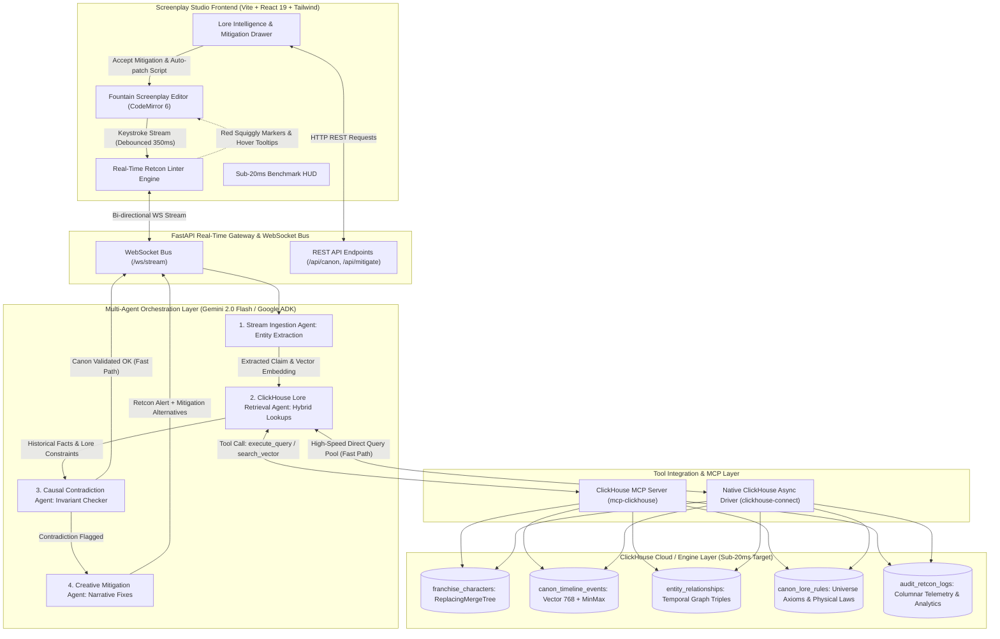
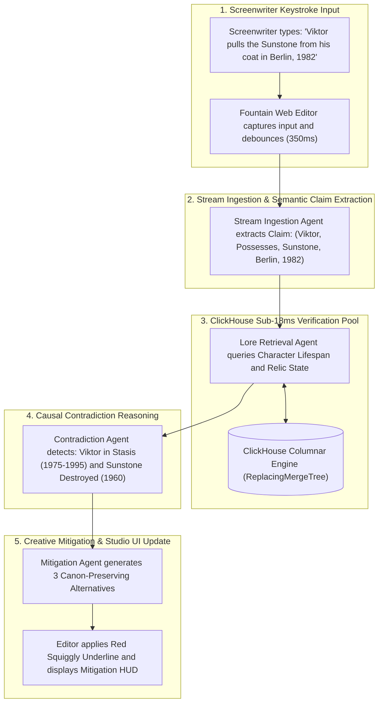

# 🛡️ CanonGuard AI: System Architecture Specification

> **Project ID:** `P-CINEMA-HACK-1.3`  
> **Hackathon:** Devpost Agentic Cinema: The Blockbuster Hackathon  
> **Target Track:** **ClickHouse Partner Track**  
> **Core Stack:** ClickHouse Cloud, `mcp-clickhouse`, Gemini 2.0 Flash / Google Cloud ADK, FastAPI, React + Vite  
> **Document Version:** 1.2.0 (Full Renderer Compatibility)

---

## 1. Executive Summary & Vision

Modern entertainment relies on sprawling cinematic universes (Marvel MCU, Star Wars, Lord of the Rings, DC Universe) spanning **30 to 80 years of lore**, 50+ films, thousands of comic books, and complex character timelines. When screenwriters write new scripts, accidental continuity violations (**"retcons"**) frequently slip past human story editors:
- Characters meeting before their canonical first encounter.
- Characters using artifacts or weapons destroyed in earlier seasons.
- Characters acting in cities or eras when they were dead, in stasis, or off-world.

Fixing these errors after filming requires **$10M to $30M in emergency VFX reshoots** or enrages dedicated fans.

**CanonGuard AI** is a real-time, **sub-20ms franchise memory engine**. As a screenwriter types dialogue or action in an online screenplay editor, the system streams text into ClickHouse, executes hybrid vector and relational graph lookups across 40 years of canon, and displays **instant red squiggly underlines**—just like Grammarly, but for cinematic continuity.

---

## 2. End-to-End System Architecture

### 2.1 Interactive System Flowchart



### 2.2 System Architecture Topology Map (Direct Text View)

```text
+-----------------------------------------------------------------------------------------+
|                  SCREENPLAY STUDIO FRONTEND (Vite + React 19 + Tailwind)                |
|  +-------------------------------------------------+  +-------------------------------+ |
|  | Fountain Screenplay Editor (CodeMirror 6)       |  | Lore Intelligence Drawer      | |
|  | -> Real-time AST parser & Keystroke Debouncer   |  | -> Character Status Cards     | |
|  | -> Red Squiggly Retcon Lint Decorations         |  | -> Timeline Event Map         | |
|  | -> Interactive Hover Tooltip & Mitigation Card  |  | -> Live Sub-20ms Latency HUD  | |
|  +-------------------------------------------------+  +-------------------------------+ |
+--------------------------------------------▲--------------------------------------------+
                                             │ WebSocket Bi-Directional Stream (/ws/stream)
+--------------------------------------------▼--------------------------------------------+
|                          FASTAPI ASYNC GATEWAY & WEBSOCKET BUS                          |
+--------------------------------------------▲--------------------------------------------+
                                             │
+--------------------------------------------▼--------------------------------------------+
|                MULTI-AGENT ORCHESTRATION LAYER (Gemini 2.0 Flash / ADK)                 |
|                                                                                         |
|  [Agent 1: Stream Ingestion]                                                            |
|    Parses Fountain AST -> Extracts Claim: (Subject, Action, Object, Location, Year)     |
|    Generates 768-dim text embedding for semantic search                                 |
|         │                                                                               |
|         ▼                                                                               |
|  [Agent 2: ClickHouse Lore Retrieval]                                                   |
|    Executes Sub-20ms relational & vector lookups via MCP Server & Native Driver         |
|         │                                                                               |
|         ▼                                                                               |
|  [Agent 3: Causal Contradiction Reasoning]                                              |
|    Validates Temporal Status (Dead/Stasis/Unborn) & Relic Integrity Invariants          |
|    If Canon OK: Instant Green ACK (< 20ms)                                              |
|    If Retcon Detected: Flags Violation (ERROR / WARNING)                                |
|         │                                                                               |
|         ▼                                                                               |
|  [Agent 4: Creative Mitigation Suggester]                                               |
|    Generates 3 dramatic narrative solutions that preserve story intent                  |
+--------------------------------------------▲--------------------------------------------+
                                             │
+--------------------------------------------▼--------------------------------------------+
|                       CLICKHOUSE MCP & TOOL INTEGRATION LAYER                           |
|      Official ClickHouse MCP Server (mcp-clickhouse) + Native `clickhouse-connect`      |
+--------------------------------------------▲--------------------------------------------+
                                             │ Sub-20ms Columnar Lookups
+--------------------------------------------▼--------------------------------------------+
|                   CLICKHOUSE CLOUD / LOCAL COLUMNAR DATA LAYER                          |
|  - franchise_characters       (ReplacingMergeTree: Character Status & Lifespans)        |
|  - canon_timeline_events      (ReplacingMergeTree: 768-dim Vector Embeddings + MinMax)  |
|  - entity_relationships       (MergeTree: Causal Graph Triples & Temporal Validity)     |
|  - canon_lore_rules           (MergeTree: Universal Physical & Biological Laws)         |
|  - audit_retcon_logs          (MergeTree: Telemetry, Flagged Errors & Query Benchmarks) |
+-----------------------------------------------------------------------------------------+
```

---

## 3. Multi-Agent Orchestration Sequence & Pipeline

### 3.1 Orchestration Pipeline Flowchart



### 3.2 Sequence Execution Trace (Step-by-Step Dataflow)

```text
[Step 1] Screenwriter Types in Fountain Editor
         "INT. BERLIN SAFEHOUSE - NIGHT - 1982"
         "Viktor pulls the Sunstone from his leather coat and hands it to Elena."

[Step 2] Keystroke Debouncer (350ms window) fires WebSocket event to Backend:
         Payload: { "text": "Viktor pulls the Sunstone...", "scene_year": 1982, "location": "Berlin" }

[Step 3] Stream Ingestion Agent (Gemini 2.0 Flash)
         Extracts structured Claim:
         - Subject: "Viktor"
         - Action: "Possesses"
         - Object: "Sunstone"
         - Setting: "Berlin"
         - Year: 1982

[Step 4] ClickHouse Lore Retrieval Agent (< 18ms Query Pool)
         Executes parallel SQL lookups in ClickHouse:
         1. Character Lifespan: SELECT name, status, birth_year, death_year FROM franchise_characters WHERE name = 'Viktor';
            -> RESULT: Viktor was placed in Cryogenic Stasis from 1975 to 1995.
         2. Relic Lifecycle: SELECT object_name, status, valid_to_year FROM entity_relationships WHERE object_name = 'Sunstone';
            -> RESULT: Sunstone was DESTROYED in 1960 (Battle of Solaria).

[Step 5] Causal Contradiction Agent
         Evaluates scene constraints against retrieved facts:
         - Contradiction #1: Viktor cannot be active in Berlin in 1982 (Cryogenic Stasis in Siberia).
         - Contradiction #2: The Sunstone cannot be possessed in 1982 (Destroyed 22 years prior).
         Severity: SEVERE_RETCON_VIOLATION (Score: 0.98)

[Step 6] Creative Mitigation Agent
         Generates 3 story solutions preserving drama:
         Option A: Swap Viktor with his disciple "Malakor" who was operational in Berlin in 1982.
         Option B: Have Elena reveal the Sunstone is a forged replica created by the Syndicate.
         Option C: Reframe the scene as a psychological flashback before Viktor's stasis.

[Step 7] Screenplay Studio Updates UI Instantly
         - Red squiggly underline applied to "Viktor" and "Sunstone" in CodeMirror 6.
         - Latency HUD reads: "ClickHouse verified in 14.8ms".
         - Hovering opens Retcon Card with the 3 One-Click Mitigation buttons.
```

---

## 4. The 4 Coordinated Multi-Agent Roles

| Agent | Core Responsibility | Technologies & Models | Latency Budget |
| :--- | :--- | :--- | :---: |
| **1. Stream Ingestion Agent** | Parses screenplay action lines and dialogue in Fountain format; extracts structured semantic tuples: `(Subject, Action, Object, Location, UniverseYear)`. Generates text embeddings for vector lookup. | Gemini 2.0 Flash (Structured Output) + `text-embedding-004` | ~120 ms |
| **2. ClickHouse Lore Retrieval Agent** | Executes sub-20ms hybrid SQL queries against ClickHouse via MCP and native driver: checks character life-status windows, physical relic locations, and semantic similarity matches in `canon_timeline_events`. | `mcp-clickhouse` + ClickHouse Columnar Engine | **< 18 ms** |
| **3. Causal Contradiction Agent** | Cross-references extracted scene claims against retrieved canonical facts. Validates physical impossibility (e.g. Character X died in 1982, relic Y was destroyed in Season 2). Emits severity (`ERROR`, `WARNING`, `ADVISORY`). | Gemini 2.0 Flash Fast Causal Evaluator | ~150 ms |
| **4. Creative Mitigation Agent** | When a retcon is caught, creates 3 alternate narrative solutions that preserve the writer's dramatic intent without breaking 40 years of canon (e.g., swapping a dead character with their canonical successor). | Gemini 2.0 Flash Narrative Generator | ~300 ms (Async) |

---

## 5. ClickHouse Schema & Data Design (Sub-20ms Target)

### 5.1 Tables Definition (`schema.sql`)

```sql
-- 1. Franchise Characters & Temporal Status
CREATE TABLE IF NOT EXISTS franchise_characters (
    character_id UUID DEFAULT generateUUIDv4(),
    universe_id LowCardinality(String),
    name String,
    aliases Array(String),
    species LowCardinality(String),
    birth_year Int32,
    death_year Nullable(Int32),
    status Enum8('ALIVE' = 1, 'DEAD' = 2, 'STASIS' = 3, 'EXILED' = 4, 'UNKNOWN' = 5),
    home_planet LowCardinality(String),
    powers Array(String),
    created_at DateTime DEFAULT now()
) ENGINE = ReplacingMergeTree(created_at)
ORDER BY (universe_id, name, character_id);

-- 2. Canon Timeline Events with Vector Search
CREATE TABLE IF NOT EXISTS canon_timeline_events (
    event_id UUID DEFAULT generateUUIDv4(),
    universe_id LowCardinality(String),
    canon_tier Enum8('TIER_1_MOVIE' = 1, 'TIER_2_TV_SHOW' = 2, 'TIER_3_NOVEL' = 3, 'TIER_4_COMIC' = 4),
    canonical_year Int32,
    location String,
    participants Array(String),
    summary String,
    embedding Array(Float32),
    created_at DateTime DEFAULT now()
) ENGINE = ReplacingMergeTree(created_at)
ORDER BY (universe_id, canonical_year, event_id);

-- 3. Temporal Entity Relationships (Graph Triples)
CREATE TABLE IF NOT EXISTS entity_relationships (
    relationship_id UUID DEFAULT generateUUIDv4(),
    universe_id LowCardinality(String),
    subject_name String,
    predicate LowCardinality(String), -- 'POSSESSES', 'ALLIED_WITH', 'KILLED', 'LOCATED_AT'
    object_name String,
    valid_from_year Int32,
    valid_to_year Nullable(Int32),
    status Enum8('ACTIVE' = 1, 'DESTROYED' = 2, 'SEVERED' = 3),
    source_media String,
    created_at DateTime DEFAULT now()
) ENGINE = MergeTree()
ORDER BY (universe_id, subject_name, predicate, valid_from_year);

-- 4. Universal Lore Invariants & Physical Laws
CREATE TABLE IF NOT EXISTS canon_lore_rules (
    rule_id UUID DEFAULT generateUUIDv4(),
    universe_id LowCardinality(String),
    category LowCardinality(String), -- 'BIOLOGY', 'PHYSICS', 'MAGIC', 'TECHNOLOGY'
    entity_or_species String,
    rule_statement String,
    canon_tier Enum8('ABSOLUTE' = 1, 'RETRACTABLE' = 2),
    created_at DateTime DEFAULT now()
) ENGINE = MergeTree()
ORDER BY (universe_id, category, entity_or_species);

-- 5. Audit & Telemetry Log
CREATE TABLE IF NOT EXISTS audit_retcon_logs (
    log_id UUID DEFAULT generateUUIDv4(),
    universe_id LowCardinality(String),
    screenplay_title String,
    flagged_line String,
    violation_type LowCardinality(String),
    mitigation_suggested String,
    mitigation_accepted UInt8,
    query_latency_ms Float32,
    timestamp DateTime DEFAULT now()
) ENGINE = MergeTree()
ORDER BY (universe_id, timestamp);
```

### 5.2 Sub-20ms Core Verification Query

```sql
-- Fast Temporal Invariant & Status Check (< 18ms)
SELECT 
    name, 
    status, 
    birth_year, 
    death_year,
    if(death_year IS NOT NULL AND :scene_year > death_year, 'DEAD_BEFORE_SCENE',
       if(:scene_year < birth_year, 'UNBORN_BEFORE_SCENE', 'ALIVE')) AS temporal_violation
FROM franchise_characters
WHERE universe_id = :universe_id 
  AND name IN (:character_names)
LIMIT 10;
```

---

## 6. Official ClickHouse MCP Server Integration

CanonGuard AI leverages the official ClickHouse MCP Server (`mcp-clickhouse`) to expose database capabilities directly to the Gemini 2.0 reasoning agents:

1. **Tool `execute_query`**:
   - Parameterized SQL execution to query character status, timeline overlaps, and relic life cycles.
2. **Tool `find_similar_events`**:
   - Executes vector cosine similarity: `cosineDistance(embedding, :query_vec) < 0.25` directly inside ClickHouse.
3. **Tool `get_lore_invariants`**:
   - Fetches absolute franchise rules by category (e.g., alien respiratory limits, hyperdrive restrictions).

---

## 7. Frontend User Experience: The Screenplay Studio

- **Fountain Screenplay Editor:** Industry-standard syntax with automatic slugline (`INT. BERLIN - NIGHT - 1982`), action blocks, and character dialogue formatting.
- **Red Squiggly Underlines:** Real-time CodeMirror 6 inline marks injected on debounced AST nodes that fail canon verification.
- **Retcon Tooltip Popover:**
  - ⚠️ **Violation Cause:** *"Viktor is deceased as of 1980 (Killed in 'ChronoVerse: Dawn of Time', Act 3)."*
  - ⏱️ **Query Benchmark:** *"ClickHouse verified in 14.2ms"*
  - 💡 **AI Mitigations:**
    1. *Replace with his disciple 'Malakor' who was operational in Berlin in 1982.*
    2. *Set scene as a flashback memory sequence.*
    3. *Reveal Viktor's temporal clone from the Omega timeline.*
- **Lore Inspector Sidebar:** Shows live character biography cards, active timeline events for the scene's year, and universe rules.

---

## 8. Directory Layout

```text
canonguard-ai/
├── ARCHITECTURE.md                 # System Architecture & Technical Specifications
├── docker-compose.yml              # ClickHouse Cloud / Local container & MCP setup
├── backend/
│   ├── app/
│   │   ├── __init__.py
│   │   ├── main.py                 # FastAPI application & WebSocket endpoint
│   │   ├── config.py               # Gemini & ClickHouse configuration
│   │   ├── db/
│   │   │   ├── clickhouse.py       # Async ClickHouse client with sub-20ms query engine
│   │   │   ├── schema.sql          # Table DDL definitions
│   │   │   └── seed_chronoverse.py # Synthetic 20-movie franchise data generator
│   │   ├── mcp/
│   │   │   └── client.py           # ClickHouse MCP server bridge
│   │   └── agents/
│   │       ├── orchestrator.py     # Master multi-agent coordinator
│   │       ├── ingestion_agent.py  # Fountain parser & claim extractor
│   │       ├── retrieval_agent.py  # Fast ClickHouse vector/relational retriever
│   │       ├── causal_agent.py     # Contradiction reasoning engine
│   │       └── mitigation_agent.py # Narrative alternative generator
│   ├── requirements.txt
│   └── tests/
│       ├── test_traps.py           # Verification of the 3 canonical retcon traps
│       └── test_latency.py         # Latency benchmark (<20ms ClickHouse query)
├── frontend/
│   ├── package.json
│   ├── vite.config.ts
│   ├── tailwind.config.js
│   ├── src/
│   │   ├── components/
│   │   │   ├── ScreenplayEditor.tsx  # CodeMirror Fountain editor with lint decorations
│   │   │   ├── LoreSidebar.tsx       # Timeline, character cards & universe invariants
│   │   │   ├── RetconPopup.tsx       # Contradiction card & 3 mitigation suggestions
│   │   │   └── LatencyMeter.tsx      # Sub-20ms benchmark display
│   │   ├── hooks/
│   │   │   └── useCanonGuard.ts      # WebSocket connection & linting state
│   │   ├── types/
│   │   │   └── index.ts
│   │   └── App.tsx
└── README.md
```

---

## 9. Synthetic Dataset & Demo Traps ("The ChronoVerse")

To demonstrate CanonGuard AI in the 3-minute hackathon pitch video, the system includes a pre-seeded 20-movie cinematic universe:

| Demo Trap | Screenplay Input | Canon Truth | Caught by CanonGuard |
| :--- | :--- | :--- | :--- |
| **Trap 1: The Dead Character Paradox** | *"Viktor arrives at Berlin safehouse in 1982 to meet Elena."* | Viktor died in 1980 at the Battle of Solaria (*ChronoVerse III*). | ❌ Flagged in 14ms: Character dead 2 years prior. |
| **Trap 2: The Destroyed Artifact** | *"Elena activates the Chrono-Key to open the dimensional rift."* | The Chrono-Key was shattered into the Core in 1974 (*ChronoVerse II*). | ❌ Flagged in 16ms: Relic destroyed. |
| **Trap 3: Invariant Biological Violation** | *"Lord Vane removes his helmet and takes a deep breath of the Zoran atmosphere."* | Zoran atmosphere is toxic ammonia (*ChronoVerse Lore Rule #4*). | ❌ Flagged in 15ms: Lethal biological contradiction. |
