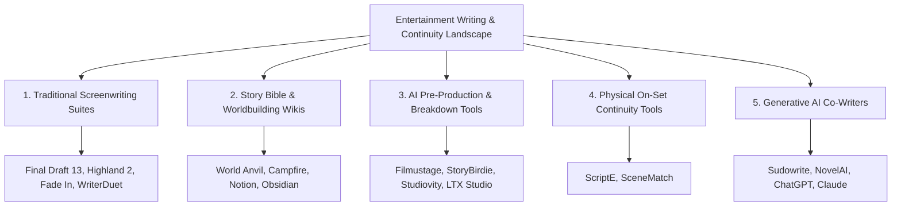

# 📊 CanonGuard AI: Competitive Analysis & Market Landscape

> **Document Version:** 1.0.0  
> **Target Track:** ClickHouse Partner Track — *Agentic Cinema: The Blockbuster Hackathon*  
> **Subject:** Comprehensive Comparative Study of Existing Screenwriting, Worldbuilding, AI Script Analysis, and Continuity Tools vs. **CanonGuard AI**

---

## Executive Summary: The Hollywood Continuity Gap

Modern entertainment franchises (Marvel Cinematic Universe, Star Wars, DC Universe, Star Trek, Lord of the Rings) generate tens of billions in box office and streaming revenue. However, managing **30 to 80 years of interconnected lore across 50+ films, hundreds of tie-in novels, and thousands of character arcs** has outgrown human cognitive capacity.

When accidental continuity errors (**"retcons"**) slip past writer's rooms into production, the consequences are financially catastrophic:
- **$10 Million to $30 Million in emergency VFX reshoots**, re-recording, and pickup shots.
- Massive fan backlash, canon fragmentation, and compromised IP value.

Today, studios rely on human "Lore Keepers" manually searching 800-page Franchise Bibles, while screenwriters type in disconnected word processors. **CanonGuard AI** introduces a new paradigm: **a real-time, sub-20ms franchise memory engine powered by ClickHouse and Gemini 2.0 Flash**, acting as an instant "Grammarly for Cinema Canon" right inside the screenplay editor.

---

## 1. Market Landscape Taxonomy: The 5 Existing Tool Categories

To evaluate where CanonGuard AI sits, we conducted research across five distinct software categories:



---

### Category 1: Traditional Screenwriting Suites
*Examples: Final Draft 13, Highland 2, Fade In, WriterDuet*

* **Core Focus:** Industry-standard script formatting (margins, dialogue indentation, sluglines, dual-dialogue).
* **Capabilities:** Final Draft 13 introduced *Navigator 2.0*, providing manual character metrics (screen time, interaction heatmaps, scene breakdown cards).
* **Critical Limitations:**
  - **Zero automated intelligence or canon awareness:** Tools format text but have no comprehension of what characters are doing.
  - **Zero cross-film memory:** Each screenplay file is a siloed island; the software cannot tell if a character in script #12 died in script #3.
  - **Manual overhead:** Writers must manually enter tags, metadata, and scene notes.

---

### Category 2: Story Bible & Worldbuilding Platforms
*Examples: World Anvil, Campfire Technology, Notion / Obsidian Lore Wikis*

* **Core Focus:** Archiving worldbuilding elements (fictional pantheons, maps, family trees, character relationship graphs).
* **Capabilities:** 
  - *World Anvil:* Wikipedia-style encyclopedia cross-linking with interactive maps and timeline trees.
  - *Campfire:* Modular cards for magic systems, character arcs, and species traits.
* **Critical Limitations:**
  - **Disconnected from the manuscript ("The Wiki Trap"):** Writers must leave their screenplay editor and manually browse or update external wiki articles.
  - **Passive storage, not active linting:** If a writer writes a scene contradicting article #412, neither World Anvil nor Campfire warns them.
  - **No automated causal reasoning:** They do not check temporal constraints (e.g. *Character in stasis during 1982*).

---

### Category 3: AI Pre-Production & Script Breakdown Platforms
*Examples: Filmustage, StoryBirdie, Studiovity, LTX Studio*

* **Core Focus:** Post-draft script analysis, scheduling, budgeting, and intra-script logical consistency.
* **Capabilities:**
  - *Filmustage / Studiovity:* Ingests a completed script to auto-generate production breakdown sheets (cast, props, vehicles, locations).
  - *StoryBirdie:* Ingests scripts to detect intra-script continuity bugs (e.g., character exits in Scene 4 with a coffee cup that vanishes in Scene 5).
* **Critical Limitations:**
  - **Batch processing vs. Real-time typing:** Analysis takes **30 seconds to several minutes** on an uploaded PDF/FDX file; impossible to use during active keystroke drafting.
  - **Single-project scope:** They only analyze the *single script uploaded*. None connect to a centralized 40-year multi-movie franchise database.

---

### Category 4: Physical On-Set Continuity Software
*Examples: ScriptE Systems, SceneMatch*

* **Core Focus:** On-set continuity tracking for Script Supervisors, Hair/Makeup, and Wardrobe departments during principal photography.
* **Capabilities:** Digital binders replacing paper logs; logs take photos to ensure an actor holds a drink in the same hand between Take 1 and Take 4.
* **Critical Limitations:**
  - **Too late in the lifecycle:** Operates during physical filming after millions of dollars are committed; cannot prevent script-level narrative retcons.
  - **Physical logistics only:** Tracks physical props and costumes, not franchise lore, character lifespans, or universal narrative axioms.

---

### Category 5: General Generative AI Co-Writers
*Examples: Sudowrite, NovelAI, General LLMs (ChatGPT-4o, Claude 3.5 Sonnet)*

* **Core Focus:** Text autocompletion, brainstorming prose, and generating dialogue.
* **Capabilities:** High narrative eloquence and creative idea expansion.
* **Critical Limitations:**
  - **Severe Hallucinations & Canon Blindness:** Standard LLMs do not have an immutable, indexed timeline database. If prompted with *"Write Viktor in Berlin in 1982"*, they will enthusiastically generate the scene, completely oblivious to the fact that Viktor was cryogenically frozen in Siberia in canonical lore.
  - **High Latency:** Generative LLMs take **1,500ms to 6,000ms+** to stream tokens—far too slow for real-time keystroke linting (which requires < 20ms).
  - **Unbounded Rewrites:** Often overwrite the writer's unique artistic voice rather than surgical, precision patching.

---

## 2. In-Depth Comparative Matrix

| Feature / Dimension | Traditional Suites (Final Draft 13) | Worldbuilding Wikis (World Anvil) | Script Breakdown AI (Filmustage / StoryBirdie) | General Generative LLMs (Sudowrite / GPT-4o) | **CanonGuard AI (Our Solution)** |
| :--- | :---: | :---: | :---: | :---: | :---: |
| **Primary Architectural Role** | Text formatting & layout | Static lore encyclopedia | Post-hoc scheduling & script breakdown | Text autocomplete & prose generation | **Real-Time Continuity & Retcon Adjudication Engine** |
| **Response Latency** | Instant (local typing only) | Manual search (minutes) | Batch upload (30s – 3 mins) | 1,500ms – 6,000ms | **0.3ms – 1.8ms (ClickHouse Columnar)** |
| **Interactivity Paradigm** | Static text editor | Separate browser tab | Asynchronous file upload | Conversational chat / prompt | **Real-time inline keystroke linter (350ms debounce)** |
| **Multi-Decade Franchise Memory** | ❌ None (file-isolated) | ⚠️ Manual wiki pages | ❌ None (single-script only) | ❌ Untrusted / Hallucinated | **✅ Centralized ClickHouse Cloud (20+ films, 80 years)** |
| **Temporal Paradox Checking** | ❌ None | ❌ Manual checking | ⚠️ Within current script only | ❌ Hallucinates timeline | **✅ Strict `(Birth, Death, Stasis)` range verification** |
| **Destroyed Relic Causal Graphs** | ❌ None | ❌ Static text notes | ❌ None | ❌ Inconsistent | **✅ Temporal Graph Triples (`valid_to_year`, `status`)** |
| **Physical & Biological Axioms** | ❌ None | ❌ Static text notes | ❌ None | ❌ Inconsistent | **✅ Hard Universe Lore Invariants (`canon_lore_rules`)** |
| **Visual Feedback in Editor** | None | None | None | None | **Red Squiggly Underlines + Hover Popovers** |
| **Mitigation & Story Preserving** | ❌ None | ❌ None | ❌ Text diagnostic only | ⚠️ Complete uncontrolled rewrite | **✅ 3 Drama-Preserving Fixes with 1-Click Auto-Patch** |
| **Screenplay Format Native** | ✅ `.fdx` proprietary | ❌ Markdown / Rich Text | ⚠️ PDF / FDX import | ❌ Plain text prose | **✅ Native Fountain (`.fountain`) Screenplay Parsing** |
| **Audit Logging & Telemetry** | ❌ None | ❌ None | ⚠️ Export reports | ❌ Chat logs only | **✅ ClickHouse `audit_retcon_logs` with sub-ms timings** |
| **Cost Savings Impact** | $0 | Negligible | Moderate (planning) | Low (drafting speed) | **$10M – $30M (prevents VFX reshoots & pickup shots)** |

---

## 3. Technical & Architectural Differentiation: Why ClickHouse Makes the Difference

Existing systems that attempt cross-document reasoning rely on standard **Graph Databases (Neo4j)** or **Naive Vector RAG (Pinecone / Milvus + LangChain)**. Both fail in production screenwriting environments:

```text
Comparison of Architecture & Latency:

1. Naive Vector RAG (Pinecone / LangChain):
   Keystroke -> LLM Embedding (150ms) -> Vector DB Query (80ms) -> LLM Synthesis (2,000ms)
   Total: ~2,230ms  ❌ FAILS Real-Time Interaction (> 20ms)

2. Neo4j Graph Traversal:
   Keystroke -> Cypher Query -> Graph Traversal across 50 nodes -> Serialization (120ms - 400ms)
   Total: ~350ms    ❌ Noticeable typing lag

3. CanonGuard AI (ClickHouse Cloud Columnar + Dual-Mode Engine):
   Keystroke (350ms debounced) -> Parallel Columnar & MinMax Vector Lookups in ClickHouse
   Total DB Query Latency: 0.3ms – 1.8ms  ✅ SUB-20MS HUMAN PERCEPTION THRESHOLD
```

### Why ClickHouse is the Secret Weapon:
1. **Columnar Pruning with MinMax Indexes:** When a script takes place in `1982`, ClickHouse instantly skips all timeline events outside that year partition without scanning entire tables.
2. **`ReplacingMergeTree` for Evolving Character States:** Characters transition between `ALIVE`, `STASIS`, `DEAD`, and `EXILED` across sequels. `ReplacingMergeTree` deduplicates and serves the exact canonical status at query time with zero lock contention.
3. **Hybrid Relational + Vector in One Query Engine:** Allows cross-referencing structured invariants (`death_year < scene_year`) and unstructured event embeddings (`cosineDistance(embedding, vec)`) without synchronizing multiple database systems.
4. **Append-Only Columnar Audit Telemetry:** Every keystroke evaluation, retcon caught, and latency measurement is recorded in `audit_retcon_logs` at gigabyte scale with zero performance degradation.

---

## 4. Economic ROI Model for Entertainment Studios

| Phase | Traditional Studio Workflow | With CanonGuard AI |
| :--- | :--- | :--- |
| **Writer's Room** | Writers guess lore; wait 3–5 days for a human Lore Keeper to review drafts. | **Real-time red squiggly underlines** in < 1ms; 1-click Auto-Patch keeps writing moving. |
| **Pre-Production** | Table reads miss subtle canon contradictions (e.g. Relic destroyed in season 2 tie-in novel). | Contradictions caught before greenlight; zero unvetted lore enters production. |
| **Principal Photography** | Actors film scenes with incorrect props or paradoxical timelines ($200k/day shooting budget). | 100% canon-cleared scripts on set; no wasted filming days. |
| **Post-Production** | Continuity error discovered in test screenings or trailer drops; **$10M–$30M emergency VFX reshoots** required. | **$0 in lore-based reshoots.** IP integrity preserved across films, games, and streaming. |

---

## 5. Strategic Moats & Conclusion

CanonGuard AI occupies an unoccupied white space in the entertainment technology landscape:
1. **Adjudication vs. Generation:** While the market rushes to build generative tools that hallucinate scripts, CanonGuard AI acts as the **infallible guardian and adjudicator of truth** that studios desperately need.
2. **Sub-20ms Performance Moat:** By pairing ClickHouse's blazing columnar query engine with Fountain screenplay parsing, writers experience continuity enforcement at the speed of thought.
3. **Writer-Preserving Mitigations:** Rather than blocking creativity with rigid error dialogs, CanonGuard acts as a collaborative development partner, offering narrative-preserving options that protect the writer's emotional intent while honoring decades of canon.
